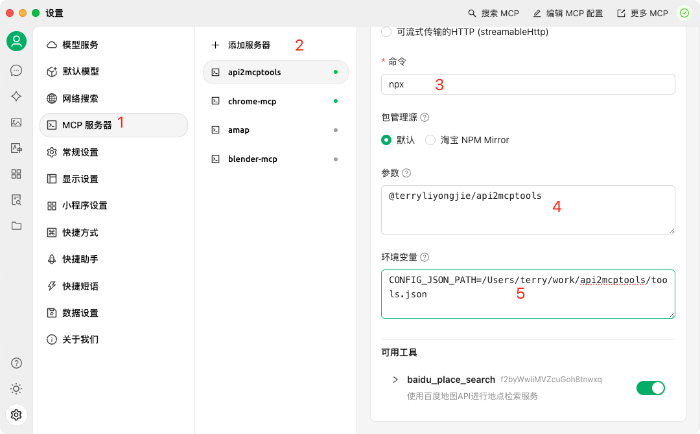

# @terryliyongjie/api2mcptools

[中文文档](./README_CN.md)

[](https://smithery.ai/server/@JayLi52/api2mcptools)
[](https://modelcontextprotocol.org)

A Node.js package that converts APIs to MCP (Model Context Protocol) tools.

- CherryStudio Example [CherryStudio](https://cherry-ai.com/)


## Installation

### Option 1: Quick Start with npx (Recommended)
```bash
set CONFIG_JSON_PATH=example.json
npx @terryliyongjie/api2mcptools
```

### Option 2: Traditional Installation
```bash
# Install locally in your project
npm install @terryliyongjie/mcp-tools

# Or install globally to use as a CLI tool
npm install -g @terryliyongjie/mcp-tools
```

## Configuration

### Environment Variables

```bash
# Required: Path to your configuration JSON file
CONFIG_JSON_PATH=example.json
```

Example configuration file (`example.json`):
```js
// Single tool configuration
{
    "name": "tool_name",
    "description": "Tool description",
    "inputSchema": {
        "type": "object",
        "properties": {
            "param1": {
                "type": "string",
                "description": "Parameter description"
            }
        },
        "required": ["param1"]
    },
    "axiosConfig": {
        "url": "https://api.example.com/endpoint",
        "method": "get",
        "params": {
            "key": "your_api_key"
        }
    }
}

// Or multiple tools configuration
[
    {
        "name": "baidu_place_search",
        "description": "使用百度地图API进行地点检索服务",
        "inputSchema": {
            "type": "object",
            "properties": {
                "query": {
                    "type": "string",
                    "description": "检索关键字"
                },
                "region": {
                    "type": "string",
                    "description": "检索行政区划区域"
                }
            },
            "required": ["query", "region"]
        },
        "axiosConfig": {
            "url": "https://api.map.baidu.com/place/v2/search",
            "method": "get",
            "params": {
                "ak": "your_baidu_map_key"
            }
        }
    },
    // More tools...
]
```

## Features

- Convert JSON APIs to MCP tools
- Easy integration with MCP ecosystem
- Support for various API types
- Command-line interface (CLI) support

## Usage

### As a CLI Tool
After installing globally, you can use the command directly in your terminal:

```bash
mcp-tools [options]
```

### As a Module
```typescript
// Example code coming soon
```

## Development

```bash
# Install dependencies
npm install

# Build the project
npm run build

# Run in development mode
npm run dev

# Watch mode during development
npm run watch

# Run MCP inspector
npm run inspector
```

## License

MIT
